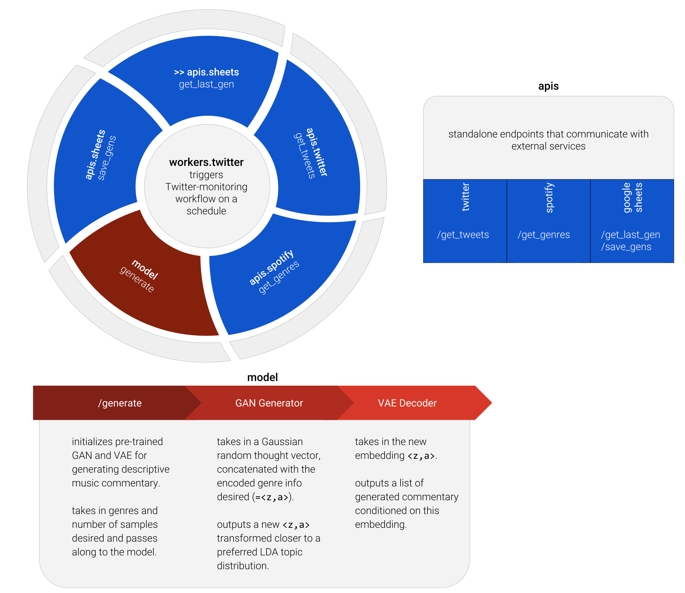
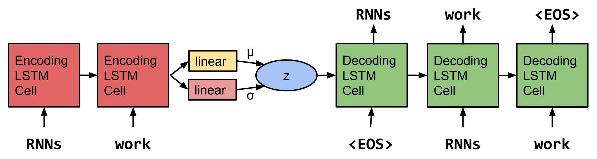
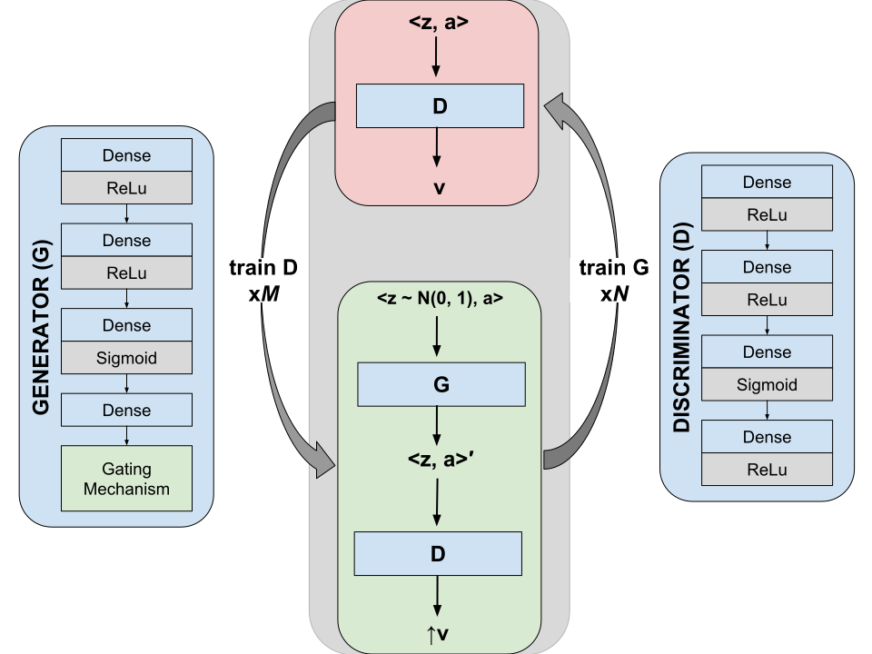

## Motivation

[@deephypebot](https://twitter.com/deephypebot) is a music commentary generator. It is essentially a _language model_, trained on past human music writing from the web and conditioned on attributes of the referenced music. There is an additional training step that attempts to encourage a certain type of descriptive, almost flowery writing commonly found in this genre.

Our goal is to teach this language model to generate consistently good and entertaining new writing about songs.

## Project Achievements

- Model inference through pre-trained LC-GAN + CVAE deep learning architecture (details below)
- Functional, documented pipeline code
- A technical white paper (_coming soon_)

## Architecture

### Training data

My training data consists of ~20,000 blog posts with writing about individual songs. The count started at about 80K post links from 5 years of popular songs on the music blog aggregator [Hype Machine](https://hypem.com/) - then I filtered for English, non-aggregated (i.e., excluding "round up"-style posts about multiple songs) posts about songs that can be found on Spotify. There was some additional attrition due to many post links no longer existing. I did some additional manual cleanup of symbols, markdown, and writing that I deemed _non_-commentary.

From there, I split the commentary into ~104,500 sentences, which are a good length for a _variational autoencoder_ (VAE) model to encode.

### Neural network

A _language model_ (LM) is an approach to generating text by estimating the probability distribution over sequences of linguistic units (characters, words, sentences). This project centers around a _sequence-to-sequence conditional variational autoencoder_ ([seq2seq CVAE](https://iconix.github.io/dl/2018/06/29/energy-and-vae#seq2seq-vae-for-text-generation)) model that generates text conditioned on a thought vector `z` + attributes of the referenced music `a` (simply concatenated together as `<z,a>`). The conditioned embedding fed into the CVAE is provided by an additional _latent constraints generative adversarial network_ ([LC-GAN](https://iconix.github.io/dl/2018/07/28/lcgan)) model that helps control aspects of the text generated.

The CVAE consists of an LSTM-based encoder and decoder, and once trained, the decoder can be used independently as a language model conditioned on latent space `<z,a>` (more on seq2seq VAEs [here](https://iconix.github.io/dl/2018/06/29/energy-and-vae#seq2seq-vae-for-text-generation)). The musical attributes info conditions only the VAE decoder.

<small>An *un*conditioned seq2seq text VAE. Replace `z` with `<z,a>` for a CVAE. Figure taken from Bowman et al., 2016. [_Generating Sentences from a Continuous Space_](https://arxiv.org/abs/1511.06349).</small>

The LC-GAN is used to determine which conditioned embeddings `<z,a>` to this LM tend to generate samples with particular attributes (more on the LC-GAN [here](https://iconix.github.io/dl/2018/07/28/lcgan)). This project uses LDA topic modeling as an automatic reward function that works with the LC-GAN to encourage samples of a descriptive, almost flowery style (more on LDA topic modeling [here](https://iconix.github.io/dl/2018/08/24/project-notes-2)). The LDA topic distribution for the sentence associated with the `<z,a>` input provides the label `v`. The generator is trained to generate a `z` such that, when combined with `a`, `<z,a>` gives the ideal topic distribution `v`, as measured by the discriminator. Once trained, the generator can be used independently to provide these conditioned embeddings to the CVAE for inference.

<small>LC-GAN architecture.</small>

The CVAE code used for this project is available here: **<https://github.com/iconix/pytorch-text-vae>**.

The LC-GAN code used for this project is available here: **<https://github.com/iconix/openai/blob/master/nbs/lcgan.ipynb>**.

### Making inference requests to the network

Now that the neural network is accounted for, let's discuss the engineering pipeline required to support inference live on Twitter.

While the model was developed in Python ([PyTorch](https://pytorch.org/), [conda](https://conda.io/docs/) environment manager), the pipeline is written using [Node.js](https://nodejs.org/en/) in order to run server-side JavaScript. This is due to how many convenient libraries already exist on [npm](https://www.npmjs.com/) for communicating with external services. The pipeline has two main components: a worker process and a multi-endpoint [Express.js](https://expressjs.com/) web service.

The web service essentially wraps existing APIs for Google Sheets, Spotify, and Twitter, providing a more convenient set of APIs to the worker.  The worker process monitors Twitter at an interval (currently every 60s) for new tweets to appear on [@deephypebot](http://twitter.com/deephypebot)'s home timeline. New tweets are defined as any tweets that have occurred since the last tweet processed by this workflow (max as enforced by the Twitter API: 200 tweets). New tweets are parsed for song and artist information, and if this is found, the information is passed on to Spotify. If Spotify accepts and responds with [genre](https://developer.spotify.com/documentation/web-api/reference/artists/get-artist/) information, this is then passed to the neural network (which is deployed behind a [Flask](http://flask.pocoo.org/) endpoint) for conditioned language modeling.

### From samples to tweets

Once multiple samples of commentary for a new proposed tweet are generated, they are added to a spreadsheet where the human curator (me) can select which samples are released to [@deephypebot](http://twitter.com/deephypebot) for tweeting.

Text generation is [a notoriously messy affair](https://iconix.github.io/dl/2018/06/20/arxiv-song-titles#text-generation-is-a-messy-affair) where "you will not get quality generated text 100% of the time, even with a heavily-trained neural network." While much effort will be put into having as automated and clean a pipeline as possible, some human supervision is prudent.

Check out [@deephypebot](http://twitter.com/deephypebot)'s live timeline below for a "best of" collection of automatically generated music commentary!

## Resources

**Software…**
- [PyTorch](https://pytorch.org/) for deep learning
- [Quilt](https://quiltdata.com/) for versioning and deploying data
- [Conda](https://conda.io/docs/) and [npm](https://www.npmjs.com/) for package and environment management in Python and JavaScript
- [Flask](http://flask.pocoo.org/) for a lightweight Python web (model) server
- [Express.js](https://expressjs.com/) for a lightweight Node.js web (API) server
- [Twit](https://github.com/ttezel/twit) for Node.js Twitter API access
- [Spotify Web API Node](https://github.com/thelinmichael/spotify-web-api-node) for Node.js Spotify Web API access
- [Node Google Spreadsheet](https://github.com/theoephraim/node-google-spreadsheet) for Node.js Google Sheets API access

## Future Work

Here are some ideas that I didn't quite get to but would love to in the future!

- [ ] A second worker agent to automatically post human-approved retweets to bot account
- [ ] A Docker-ized pipeline
- [ ] Enable @ tweets of the bot to trigger on-demand samples
- [ ] Try out conditioning VAE on audio features instead of genre
- [ ] Try out sentiment from deepmoji as an automatic rewards functions for the LC-GAN
- [ ] Online learning with tweet likes
- [ ] Further data source diversity (e.g, from Tumblr, SoundCloud comments, etc.)
- [ ] Try out a VAE pre-trained on Wikipedia or some other large, relevant corpus
