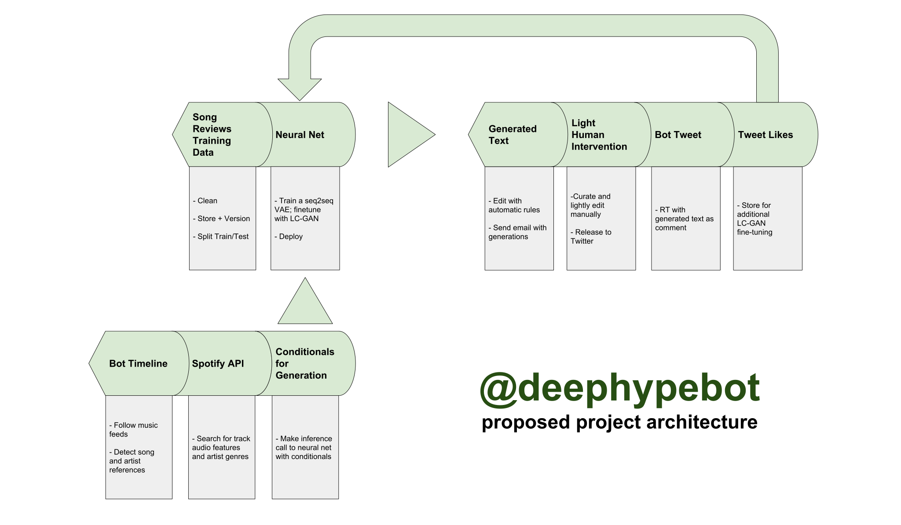

# [@deephypebot](http://twitter.com/deephypebot)
_A music commentary generator._

_Nadja Rhodes -- [OpenAI Scholar](https://github.com/iconix/openai) Final Project_

## Description
_tl;dr- auto-generating conditioned music commentary on Twitter._

The [theme of my summer](https://iconix.github.io/dl/2018/06/03/project-ideation#finding-my-niche) as an OpenAI Scholar has been explorations around music + text. I find the language around music - manifested by hundreds of ["nice, small blogs"](https://www.theverge.com/2018/1/2/16840940/spotify-algorithm-music-discovery-mix-cds-resolution) on the internet - to be a deep and unique well of creative writing.

As such, my final project will pay homage to these labors of love on the web and attempt to **auto-generate consistently good and entertaining new writing about songs, based on a set of characteristics about the song and knowledge of past human music writing**.

The project will culminate in a **Twitter bot ([@deephypebot](http://twitter.com/deephypebot))** that will monitor other music feeds for songs and automatically generate thoughts/opinions/writing about the songs.

## Project Architecture

### Training data

My training data consists of ~20,000 blog posts with writing about individual songs. The count started at about 80K post links from 5 years of popular songs on the music blog aggregator [Hype Machine](https://hypem.com/) - then I filtered for English, non-aggregated (i.e., excluding "round up"-style posts about multiple songs) posts about songs that can be found on Spotify. There was some additional attrition due to many post links no longer existing. I did some additional manual cleanup of symbols, markdown, and writing that I deemed _non_-commentary.

From there, I split the commentary into sentences, which are a good length for a _variational autoencoder_ (VAE) model to encode.

### Neural network

A _language model_ (LM) is an approach to generating text by estimating the probability distribution over sequences of linguistic units (characters, words, sentences). This project centers around a _sequence-to-sequence conditional variational autoencoder_ (seq2seq CVAE) model that generates text conditioned on a thought vector `z` + attributes of the referenced music `v` (simply concatenated together as `cat(z, v)`). The conditional fed into the CVAE is provided by an additional _latent constraints generative adversarial network_ (LC-GAN) model that helps control aspects of the text generated.

The CVAE consists of an LSTM-based encoder and decoder, and once trained, the decoder can be used independently as a language model conditioned on latent space `cat(z, v)` (more on seq2seq VAEs [here](https://iconix.github.io/dl/2018/06/29/energy-and-vae#seq2seq-vae-for-text-generation)). The conditional input is fed into the decoder only.

The LC-GAN is used to determine which conditional inputs `cat(z, v)` to this LM tend to generate samples with particular attributes (more on the LC-GAN [here](https://iconix.github.io/dl/2018/07/28/lcgan)). This project uses LDA topic modeling as its automatic reward function for encouraging samples of a descriptive, almost flowery style (more on LDA topic modeling [here](https://iconix.github.io/dl/2018/08/24/project-notes-2)). The generator is trained to fool the discriminator with "fake" (e.g., not from training data) samples, ostensibly from the desired topic set. Once trained, the generator can be used independently to provide conditional inputs to the CVAE for inference.

### Making inference requests to the network

Once the neural network is trained and deployed, this project will use it to generate new writing conditioned on either [audio features](https://developer.spotify.com/documentation/web-api/reference/tracks/get-audio-features/) or [genre](https://developer.spotify.com/documentation/web-api/reference/artists/get-artist/) information pulled from the Spotify API (depending on which conditioning seems to work better).

This will require detecting the song and artist discussed in tweets that show up on [@deephypebot](http://twitter.com/deephypebot)'s timeline and then sending this information to Spotify. Then Spotify's response will be sent to the neural network.

### From samples to tweets

Text generation is [a notoriously messy affair](https://iconix.github.io/dl/2018/06/20/arxiv-song-titles#text-generation-is-a-messy-affair) where "you will not get quality generated text 100% of the time, even with a heavily-trained neural network." While much effort will be put into having as automated and clean a pipeline as possible, some human supervision is prudent.

Once generations for a new proposed tweet are available, an email will be sent to the human curator (me), who will select and lightly edit for grammar and such before releasing to [@deephypebot](http://twitter.com/deephypebot) for tweeting.

## Resources

**Reading...**
- "Starting an Open Source Project" by GitHub [[guide](https://opensource.guide/starting-a-project/)] - #oss
- "Rules of Machine Learning: Best Practices for ML Engineering" by Google [[guide](https://developers.google.com/machine-learning/guides/rules-of-ml/)] - #eng
- Sculley, D., Holt, G., Golovin, D., Davydov, E., Phillips, T., Ebner, D., Chaudhary, V., Young, M (2014). _Machine Learning: The High-Interest Credit Card of Technical Debt._ [[paper](https://ai.google/research/pubs/pub43146)] - #eng
- "Build Your Own Twitter Bots!" [[code](https://github.com/handav/twitter-bots)] [[video](https://egghead.io/courses/create-your-own-twitter-bots)] - #twitterbot
    - A class by fellow Scholar, [Hannah Davis](http://www.hannahishere.com/)!
- "Web API Tutorial" by Spotify [[guide](https://developer.spotify.com/documentation/web-api/quick-start/)] - #spotify
- Sohn, K., Yan, X., Lee, H. _Learning Structured Output Representation using Deep Conditional Generative Models._ [CVAE [paper](http://papers.nips.cc/paper/5775-learning-structured-output-representation-using-deep-conditional-generative-models.pdf)] - #vae
- Engel, J., Hoffman, M., Roberts, A. (2017). _Latent Constraints: Learning to Generate Conditionally from Unconditional Generative Models._ [LC-GAN [paper](https://arxiv.org/abs/1711.05772)] - #gan
- "Deploying a Python Flask app on Heroku" by John Kagga [[guide](https://medium.com/the-andela-way/deploying-a-python-flask-app-to-heroku-41250bda27d0)] - #eng
- "The Flask Mega-Tutorial Part XIX: Deployment on Docker Containers" by Miguel Grinberg [[guide](https://blog.miguelgrinberg.com/post/the-flask-mega-tutorial-part-xix-deployment-on-docker-containers)] - #eng
- Bernardo, F., Zbyszynski, M., Fiebrink, R., Grierson, M. (2016). _Interactive Machine Learning for End-User Innovation._ [[paper](http://research.gold.ac.uk/19767/)] - #onlinelearning

**Software…**
- [PyTorch](https://pytorch.org/) for deep learning
- [Quilt](https://quiltdata.com/) for versioning and deploying data
- [Conda](https://conda.io/docs/) and [npm](https://www.npmjs.com/) for package and environment management in Python and JavaScript
- [Flask](http://flask.pocoo.org/) for a lightweight Python web (model) server
- [Express.js](https://expressjs.com/) for a lightweight Node.js web (API) server
- [Twit](https://github.com/ttezel/twit) for Node.js Twitter API access
- [Spotify Web API Node](https://github.com/thelinmichael/spotify-web-api-node) for Node.js Spotify Web API access
- [Node Google Spreadsheet](https://github.com/theoephraim/node-google-spreadsheet) for Node.js Google Sheets API access

## Timeline

**August 3**: _Project dev spec + preliminary tasks; LC-GAN experiments towards better/controllable samples_

- [x] Preliminary project tasks
    - [x] Developer spec
    - [x] Data cleaning and versioning
    - [ ] Permanent train/test split
    - [x] Genre collection from Spotify
    - [x] Metric definitions; benchmarking/baselines
        - Perplexity
        - Using discriminators to measure accuracy? (real/fake, genre, etc.)
    - [x] Chat with Natasha and Jesse about more sophisticated modeling for later weeks
- [x] LC-GAN experiments
    - [x] Experiment with solo discriminator vs joint: e.g., realism vs realism + readability/grammaticality
    - [x] Investigate differences in training discriminator on Gaussian random z’s vs. sample-based z’s
    - [ ] Experiment with maximizing a single quality (e.g., sentiment) of a sample
    - [ ] Do balanced class labels matter?

**August 10**: _Twitter bot + production pipeline ready_

- [x] What Twitter feeds to watch
    - [@chartdata](https://twitter.com/chartdata)
    - [@hypem](https://twitter.com/hypem)
    - [@SoundCloud](https://twitter.com/SoundCloud)
- [x] How to watch Twitter feeds for songs
    - Via bot's [home timeline](https://developer.twitter.com/en/docs/tweets/timelines/api-reference/get-statuses-home_timeline.html)
- [x] How to build a Twitter bot
    - [x] Twitter API registration
- [x] How to retrieve song title and artist from tweets
    - Short answer: regex foolishness
- [x] How to request audio features and genres from an app
    - [x] Spotify API registration
- [x] Hook up a dummy/heuristic model
- [x] Some automatic post-processing
    - Removes UNK token and consecutive duplicate words
- [x] Samples -&gt; Google Sheets process
- [ ] Google Sheets -&gt; Tweets process
- [ ] [Bonus] Likes -&gt; Model process

**August 17**: _More sophisticated modeling_

- [x] Experiments on conditioning VAE vs. LC-GAN on topic models (LDA)
    - Would be cool to demonstrate Bayesian techniques and understanding through LDA
- [ ] Experiments on conditioning VAE vs. LC-GAN on sentiment (deepmoji), audio features/genre...
- [ ] Retrain VAE with focus on reconstruction error (lower KL constraint σ)
- [x] Time to get best samples possible
    - Fancier VAEs?

**August 24**: _End-to-end integrations_

- [ ] How to deploy a model
    - Especially a 2GB+ one
- [x] Select and integrate final production model

**August 31**: _Project due_

## Mentor support
_Mentor: [Natasha Jaques](https://twitter.com/natashajaques)_

- Assistance in reasoning over neural net architecture decisions
- Connection to LC-GAN paper author, Jesse Engel, for queries
- Assistance in understanding how LDA works
- Assistance in debugging model training
- Suggestions for model enhancement

### _Follow my progress this summer with my blog's [#openai](https://iconix.github.io/tags/openai) tag, or on [GitHub](https://github.com/iconix/openai)._
